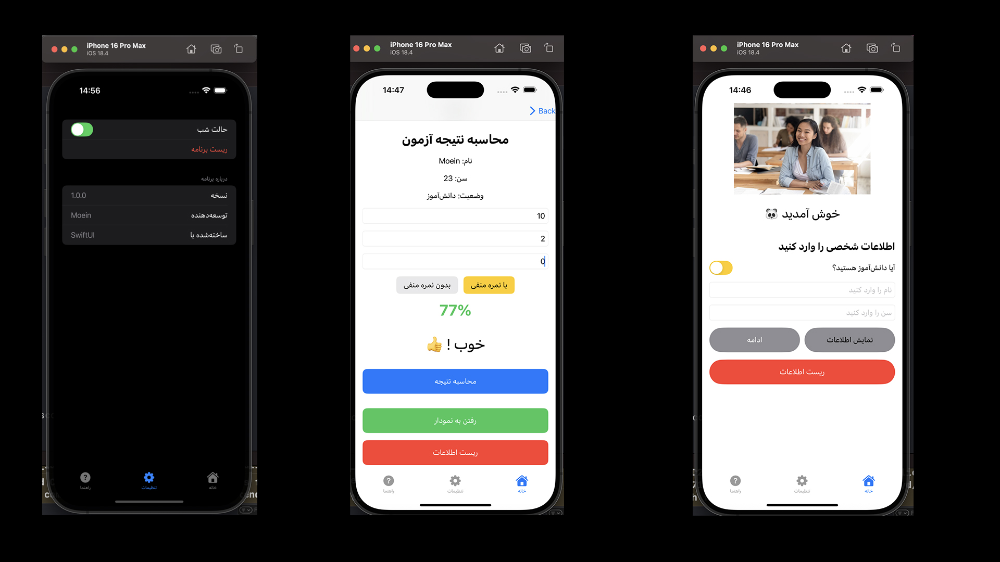

# ScoreWise | آزمون‌یار 🎯

## 📱 معرفی اپلیکیشن (Persian)
**ScoreWise** یک اپلیکیشن ساده‌ی iOS است که برای محاسبه و تحلیل نمرات آزمون‌ها طراحی شده‌است. کاربران می‌توانند تعداد پاسخ‌های صحیح، غلط و بدون پاسخ را وارد کرده و نمره نهایی، پیام عملکرد، و نمودار درصد را مشاهده کنند.

### ✨ امکانات:
- محاسبه‌ی درصد نهایی آزمون
- پیام هوشمند بر اساس نمره
- نمایش نمودار عملکرد
- طراحی ساده و کاربرپسند

---

## 📱 About the App (English)
**ScoreWise** is a simple iOS app developed to calculate and analyze exam scores. Users input the number of correct, incorrect, and unanswered questions, and the app displays the final score, a smart feedback message, and a performance chart.

### ✨ Features:
- Final exam score calculation
- Smart feedback message based on score
- Performance visualization chart
- Simple and user-friendly design

---

## 🖼️ اسکرین‌شات | Screenshot

---

> Developed with ❤️ using SwiftUI.
