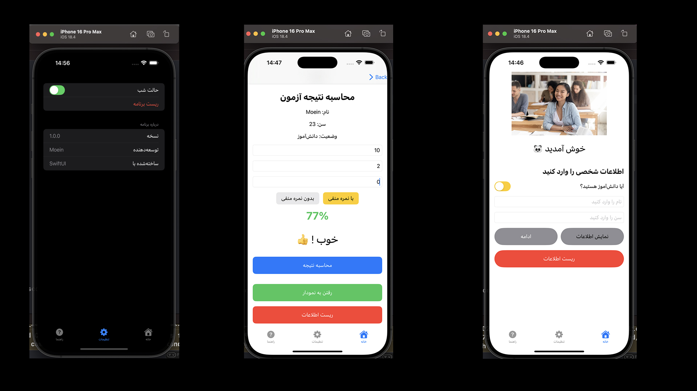

<div align="center">

# ScoreWise

**A SwiftUI exam-score calculator for iOS — enter what you got right, wrong and skipped, and see where you actually stand.**

[](https://developer.apple.com)
[](https://swift.org)
[](https://developer.apple.com/xcode/swiftui/)
[](https://developer.apple.com/documentation/charts)
[](LICENSE)



</div>

---

## What it does

Multiple-choice exams in Iran are usually marked with a negative penalty: three wrong answers cancel one correct one. Working out where you landed means doing that arithmetic by hand, every time.

ScoreWise does it for you. Enter the number of correct, incorrect and unanswered questions, pick whether the exam uses negative marking, and it returns your percentage, a plain-language verdict, and a chart of how your results have moved over time.

## Features

- **Both marking schemes** — with negative marking (−⅓ per wrong answer) or without
- **Instant percentage** with a readable verdict rather than a bare number
- **Progress chart** built on Swift Charts, so a run of results shows a trend, not just a score
- **Pick an avatar** — a small bit of personality that carries through the app
- **Dark mode**, remembered between launches
- **Persian interface**, laid out right-to-left throughout

## Built with

- **SwiftUI** — the whole interface, no UIKit
- **Swift Charts** — the score history graph
- **`@AppStorage`** — avatar choice and appearance survive a relaunch
- **`ObservableObject`** view models for score history and app state

## Project structure

```
project 1/
├── AppEntry.swift          @main — routes to avatar picker or main tabs
├── Models.swift            Avatar, ScoreEntry, ScoreViewModel, AppStateViewModel
├── MainTabView.swift       Home / Settings / Tutorial tabs
├── HomeView.swift          Entry gate for the home tab
├── MainContentView.swift   Name, age and student toggle
├── ScoreInputView.swift    Answer counts, marking mode, result
├── ScoreChartView.swift    Score history chart
├── SettingsView.swift      Dark mode, reset, about
└── TutorialView.swift      How to use the app
```

## How the score is calculated

Everything is scaled by three so the "three wrong cancel one right" rule stays in
whole numbers rather than accumulating rounding error:

```
total    = correct + incorrect + unanswered
maxScore = total × 3

raw = correct × 3 − incorrect     // with negative marking
raw = correct × 3                 // without

score = clamp(raw ÷ maxScore × 100, 0...100)
```

The result is clamped to 0–100, so a run of wrong answers cannot produce a negative
percentage. Both a zero-question total and non-numeric input are rejected before any
arithmetic runs.

## Running it

```bash
git clone https://github.com/themoein100/ScoreWise.git
cd ScoreWise
open "project 1 .xcodeproj"
```

Requires Xcode 15+ and iOS 17+ (Swift Charts and the two-parameter `onChange` both need it). No dependencies, no configuration, no API keys — build and run.

## Contributing

Issues and pull requests are welcome. Good places to start:

- English localisation alongside the Persian interface
- Persisting score history to disk — it currently lives only in memory
- Subject tags, so results can be charted per subject
- Unit tests for the scoring maths

## License

MIT — see [LICENSE](LICENSE).
